# 基于 STM32 + FreeRTOS 的智能拐杖系统

> 本项目为本科毕业设计开源整理版本，完成了一套以 **STM32G431CBU6** 为核心、基于 **FreeRTOS** 的多功能智能拐杖原型系统。系统集成 MPU6050、HC-SR04、GPS、4G 短信、光敏传感器、OLED、蜂鸣器及 LED 照明等模块，实现跌倒检测、障碍预警、自动照明、定位显示和短信报警等功能。

<p align="center">
  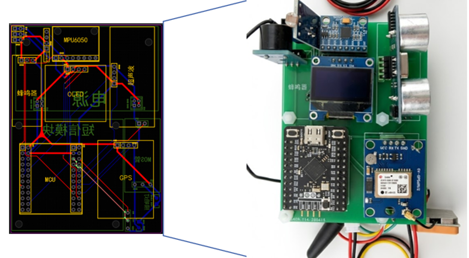
</p>

<p align="center">
  <b>PCB 版图与实物原型</b>
</p>

---

## 1. 项目简介

传统拐杖主要提供物理支撑，难以主动感知跌倒、前方障碍、环境亮度和位置信息。本项目在普通拐杖基础上加入嵌入式控制、惯性传感、超声波测距、GPS 和 4G 通信模块，使拐杖具备一定的环境感知与主动报警能力。

系统以 **STM32G431CBU6** 为主控，使用 **FreeRTOS** 对各功能任务进行调度。硬件采用自制双面 PCB，各模块通过排针/排母插接，便于独立调试、维修和后续扩展。

### 主要功能

- **跌倒检测**：MPU6050 采集三轴加速度和角速度，通过互补滤波计算姿态角；当 Roll 角持续超过设定阈值时确认跌倒。
- **障碍物检测**：HC-SR04 实时检测前方距离，障碍过近时通过蜂鸣器进行提醒。
- **GPS 定位**：通过 UART 中断接收 NMEA 数据，并解析定位坐标。
- **4G 短信报警**：跌倒确认后，由 A7670 模块直接向预设联系人发送报警短信，无需手机作为中转设备。
- **自动照明**：通过 ADC 采集环境光照，在光线不足时自动驱动 LED 照明。
- **OLED 显示**：显示环境光照、GPS 坐标、障碍距离和姿态信息。
- **FreeRTOS 多任务管理**：传感器采集、显示、报警等功能独立运行，降低不同模块之间的耦合。

---

## 2. 系统总体架构

系统可以分为 **感知层、处理层和输出层** 三部分：

- **感知层**：MPU6050、HC-SR04、光敏传感器、GPS；
- **处理层**：STM32G431CBU6 + FreeRTOS；
- **输出层**：OLED、蜂鸣器、LED 照明、A7670 4G 短信模块。

<p align="center">
  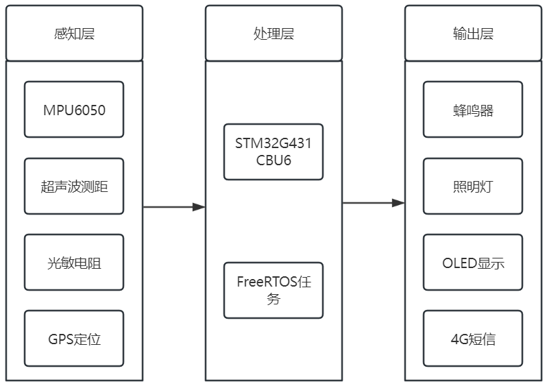
</p>

<p align="center">
  <b>系统总体架构</b>
</p>

整体数据流可以简单理解为：

```text
传感器采集
   │
   ├── MPU6050 ──> 姿态解算 ──> 跌倒判断 ──> 4G 短信报警
   │
   ├── HC-SR04 ──> 距离计算 ──> 障碍物判断 ──> 蜂鸣器提醒
   │
   ├── 光敏传感器 ──> ADC ──> 光照判断 ──> LED 自动照明
   │
   └── GPS ──> UART/NMEA 解析 ──> OLED/定位信息
```

---

## 3. 硬件组成

| 模块 | 型号/方案 | 主要用途 |
| --- | --- | --- |
| 主控 | STM32G431CBU6 | 数据处理、任务调度与外设控制 |
| IMU | MPU6050 / GY-521 | 三轴加速度、三轴角速度、姿态检测 |
| 超声波 | HC-SR04 | 前方障碍物距离检测 |
| GPS | GY-GPS6MV2 / NEO-6M | 经纬度定位 |
| 4G 通信 | A7670 | AT 指令控制、短信报警 |
| 光敏传感器 | 光敏电阻模块 | 环境亮度检测 |
| 显示 | 0.96 inch OLED | 系统状态和传感器信息显示 |
| 报警 | 有源蜂鸣器 | 障碍物声音提醒 |
| 照明 | LR7843 MOS + LED | 低照度环境自动照明 |

### MPU6050

MPU6050 同时集成三轴加速度计和三轴陀螺仪，通过 I2C 与 STM32 通信。本项目利用加速度计的静态稳定性与陀螺仪的动态响应特性进行互补滤波。

<p align="center">
  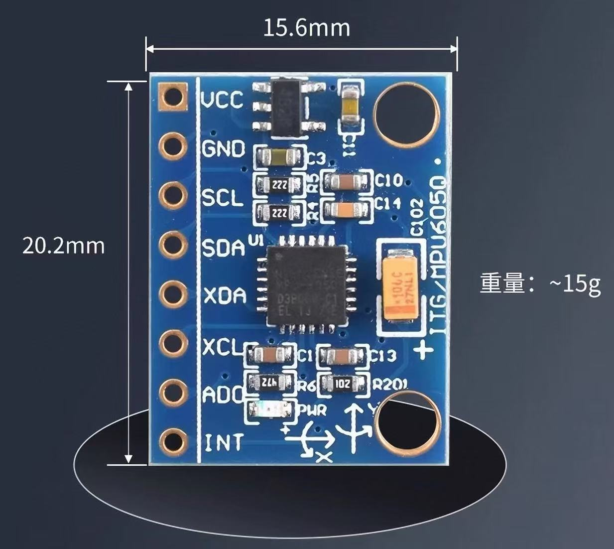
</p>

### HC-SR04

HC-SR04 通过 Trig/Echo 引脚工作，STM32 使用定时器输入捕获测量 Echo 高电平持续时间，并换算为障碍物距离。

<p align="center">
  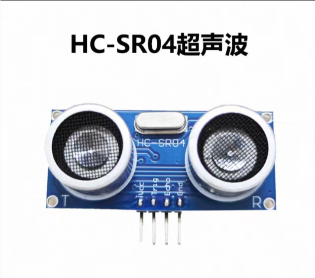
</p>

### GPS

GPS 模块通过 UART 输出 NMEA-0183 格式数据，程序采用串口中断逐字节接收并进行缓存和解析。

<p align="center">
  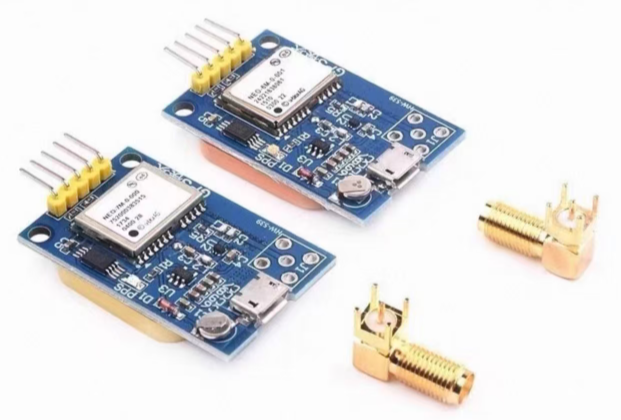
</p>

### A7670 4G 模块

A7670 通过 UART 与 STM32 通信，由 AT 指令控制短信发送。跌倒事件确认后，可以直接从设备端完成报警通知。


<p align="center">
  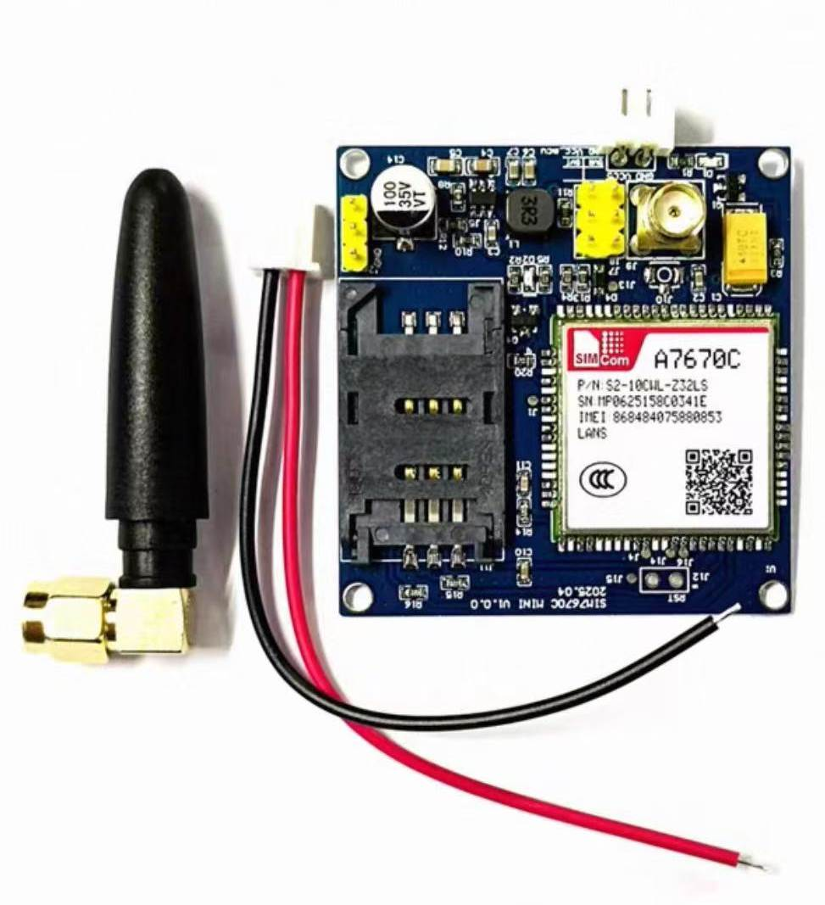
</p>

---

### 5V/3.3V电源锂电池模块

给其他硬件模块提供5V或者3.3V供电

<p align="center">
  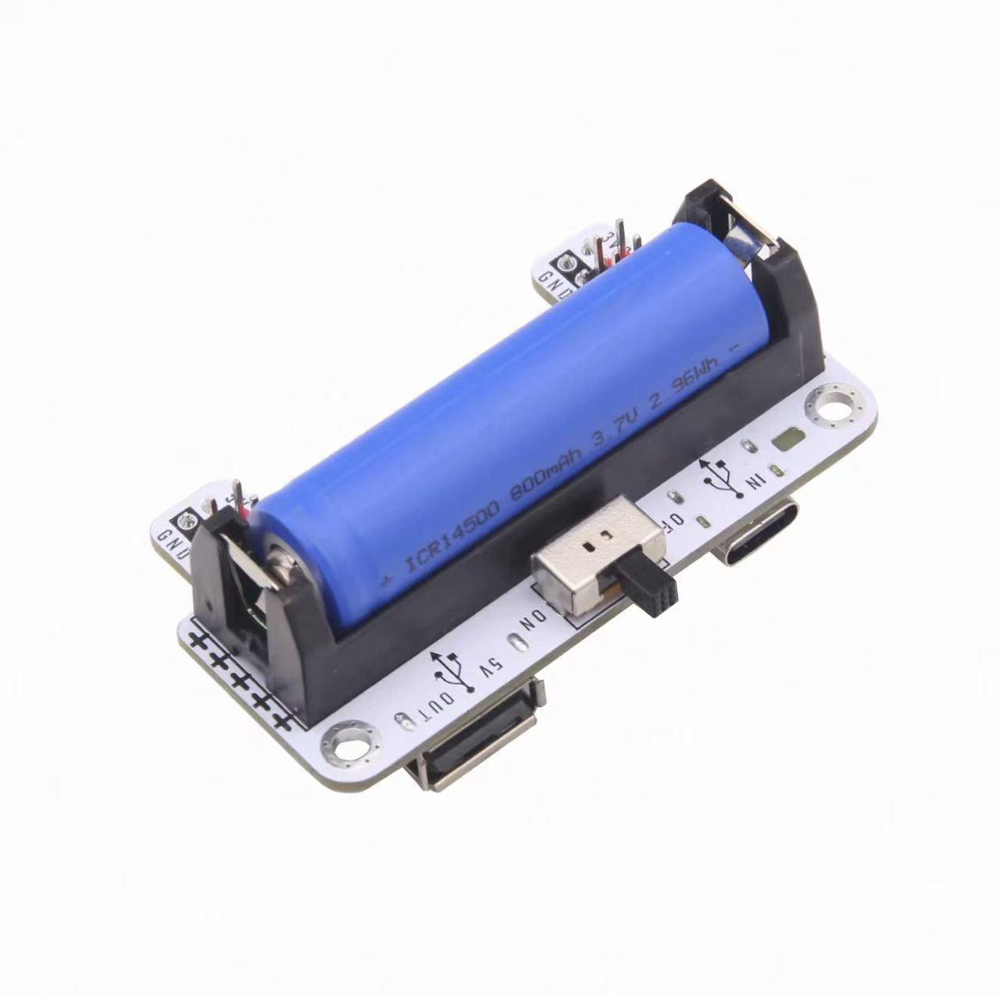
</p>


## 4. PCB 设计

硬件采用双面 PCB 设计，将传感器接口、主控、电源管理、通信以及照明驱动划分为不同功能区域。

### 主控传感器面

主要包括：

- STM32 主控及 IO 引出；
- MPU6050 接口；
- OLED 接口；
- GPS 接口；
- 光敏传感器接口；
- 蜂鸣器接口；
- HC-SR04 接口。

<p align="center">
  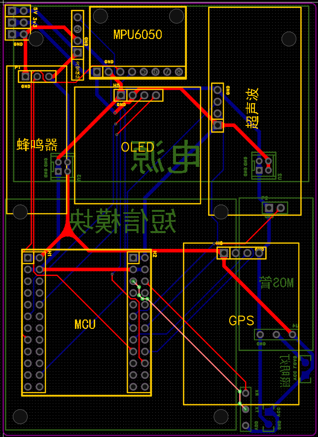
</p>

### 电源与通信面

主要包括：

- 电源输入与供电接口；
- A7670 4G 模块接口；
- MOS 照明驱动；
- LED 输出接口。

<p align="center">
  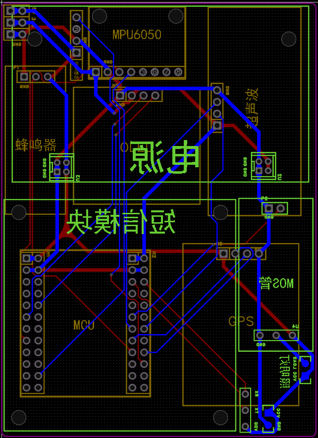
</p>

实际打样并安装各模块后的效果如下：

<p align="center">
  
</p>

---

## 5. 软件设计

软件基于 **STM32 HAL Library + FreeRTOS** 开发，各功能尽量拆分为独立任务。

核心程序入口包括：

- `main.c`：系统时钟、GPIO、I2C、USART、TIM、ADC、OLED 与 FreeRTOS 初始化；
- `app_freertos.c`：FreeRTOS 任务创建、传感器采集与应用层逻辑；
- 其余驱动文件分别负责 MPU6050、GPS、HC-SR04、OLED 等硬件模块。

### FreeRTOS 任务示意

```text
FreeRTOS Scheduler
│
├── MPU6050 Task
│   ├── IMU 数据采集
│   ├── 姿态计算
│   └── 跌倒状态判断
│
├── GPS Task
│   └── NMEA 数据解析
│
├── HC-SR04 Task
│   └── 超声波测距
│
├── Light Task
│   └── ADC 光照采样
│
├── OLED Task
│   └── 信息显示
│
├── Buzzer Task
│   └── 声音报警
│
└── 其他控制/报警任务
```

当前不同功能采用不同刷新周期，以兼顾实时性和系统资源占用。例如姿态检测属于高实时性任务，而 OLED 显示和环境光检测可以使用相对较低的刷新频率。

---

## 6. 跌倒检测算法

本项目没有简单地使用单一加速度阈值判断跌倒，而是融合 MPU6050 的加速度计和陀螺仪数据进行姿态估计。

### 互补滤波

加速度计能够根据重力方向得到较稳定的静态姿态参考，但容易受到动态振动影响；陀螺仪短时间响应平滑，但积分后会产生漂移。因此采用互补滤波融合两者：

```text
姿态角 = α × (上一时刻姿态角 + 陀螺仪角速度 × dt)
       + (1 - α) × 加速度计姿态角
```

毕业设计中使用的典型参数为：

```text
α  = 0.98
dt = 0.01 s
```

即主要保留陀螺仪的动态信息，再使用加速度计持续校正长期漂移。

### 跌倒确认状态机

系统持续监测横滚角 Roll。为了避免弯腰、坐下、短时倾斜等动作被误判为跌倒，引入“角度阈值 + 持续时间”的二次确认机制。

```text
正常状态
   │
   ├── |Roll| <= 60° ──> 保持正常
   │
   └── |Roll| > 60°
          │
          v
      疑似跌倒
          │
          ├── 10 s 内恢复 ──> 返回正常
          │
          └── 持续超过 10 s
                    │
                    v
                确认跌倒
                    │
                    v
               触发短信报警
```

<p align="center">
  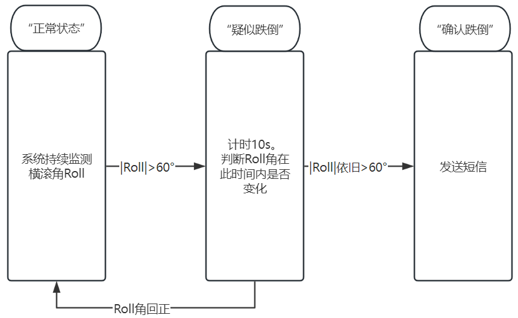
</p>

---

## 7. 障碍物检测

HC-SR04 周期性测量拐杖前方距离。程序通过 TIM 输入捕获记录 Echo 脉冲宽度，并计算距离：

```text
Distance = Echo_Time × Speed_of_Sound / 2
```

当距离低于设定阈值时，可触发蜂鸣器提醒使用者注意前方障碍物。

---

## 8. 自动照明

光敏传感器连接 STM32 ADC，程序将 12 bit ADC 数据转换为环境光照百分比：

```c
light_percent = 100 - (adc_value * 100 / 4095);
```

当环境亮度低于设定阈值时，通过 MOS 管自动开启 LED 照明；环境恢复明亮后自动关闭，从而减少用户手动操作。

---

## 9. GPS 数据接收

GPS 模块使用 UART 中断逐字节接收数据：

```text
GPS Module
    │
    v
USART RX Interrupt
    │
    v
HAL_UART_RxCpltCallback()
    │
    v
GPS Buffer
    │
    v
NMEA Parse
    │
    v
Latitude / Longitude
```

当收到一条完整 NMEA 语句后再进行解析，从而减少阻塞式串口读取对其他 FreeRTOS 任务的影响。

---

## 10. OLED 显示效果

OLED 用于显示系统运行状态以及传感器结果，包括 GPS、距离、姿态角和光照等信息。

<p align="center">
  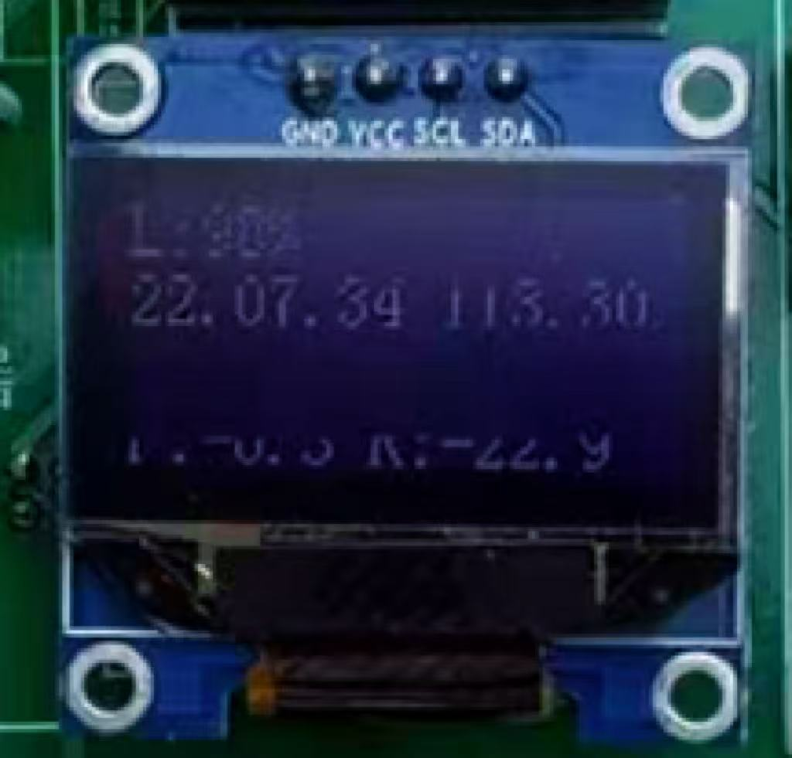
  &nbsp;&nbsp;&nbsp;
  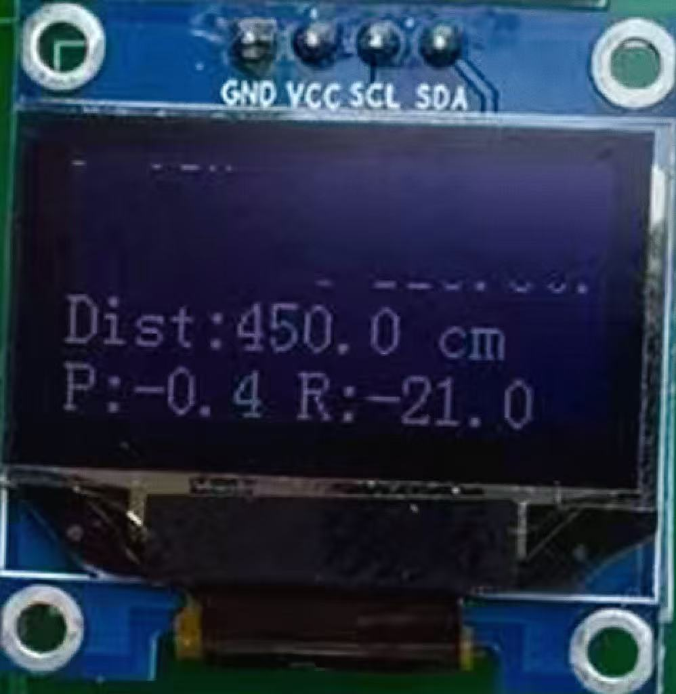
</p>

---

## 11. 4G 短信报警效果

跌倒确认后，系统通过 A7670 模块直接发送报警短信。该方案不依赖手机 APP 或蓝牙中转，设备本身即可完成通信。

<p align="center">
  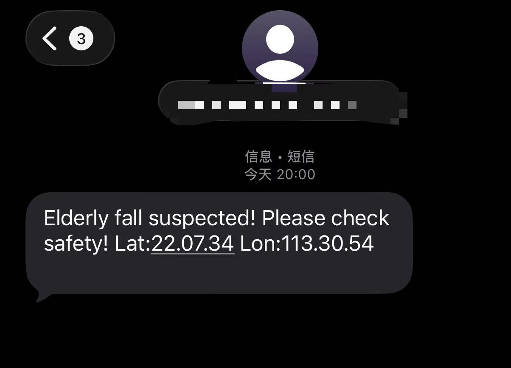
  &nbsp;&nbsp;&nbsp;
  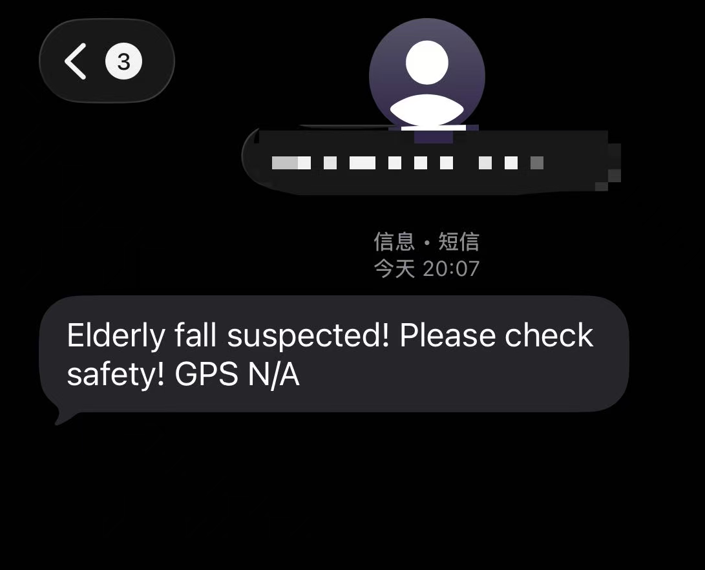
</p>

---

## 12. 外设接口

项目主要使用以下 STM32 外设：

| STM32 外设 | 用途 |
| --- | --- |
| I2C | MPU6050、OLED |
| USART | GPS、4G 模块、调试输出 |
| ADC | 光敏传感器 |
| TIM Input Capture | HC-SR04 Echo 脉宽测量 |
| GPIO | 蜂鸣器、MOS/LED 等数字控制 |
| FreeRTOS | 多任务调度与事件同步 |

---

## 13. 开发环境

- **MCU**：STM32G431CBU6
- **Language**：C
- **HAL**：STM32 HAL Library
- **RTOS**：FreeRTOS / CMSIS-RTOS
- **Configuration**：STM32CubeMX
- **IDE**：Keil MDK / STM32CubeIDE
- **PCB**：双层 PCB，自制主控底板

---

## 14. 如何使用

> 硬件+软件

1. 根据图片购买相对应的模块；

2. 点击开源工程到嘉立创PCB打板：https://oshwhub.com/lds2003/project_qvkukolh

3. 根据stm32cubmx配置图去给模块和板子相对应接线

4. Clone 或下载本仓库；

5. 使用 Keil MDK 或 STM32CubeIDE 打开工程；

6. 修改app_freertos.c中第583行的求救电话

   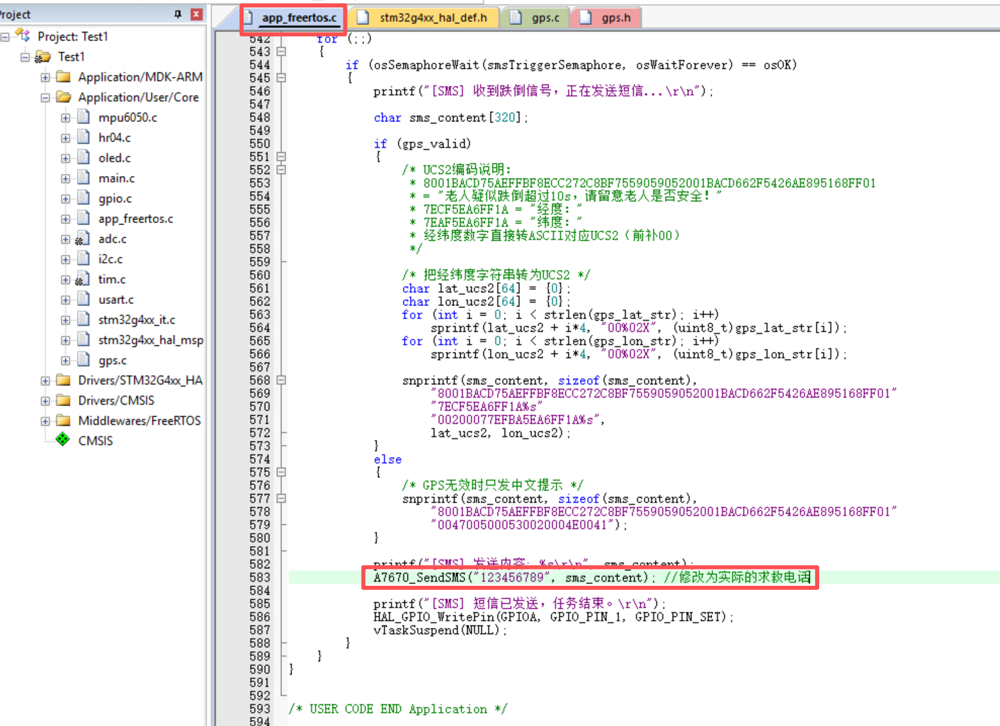

7. 编译并烧录程序；

8. 打开串口调试工具查看传感器输出；

9. 上电后保持3s拐杖处于正常姿态，等待姿态传感器完成初始化/校准；

10. 分别测试姿态检测、超声波测距、GPS、OLED、光照和报警功能。

---

## 15. 项目测试

主要模块完成了独立测试和整机联调，包括：

- MPU6050 姿态检测；
- 跌倒状态判定；
- HC-SR04 超声波测距；
- 自动照明；
- GPS 定位；
- OLED 显示；
- A7670 短信报警；
- FreeRTOS 多任务协同运行。

硬件已完成 PCB 打样、焊接和模块装配，并完成基本功能验证。

---

## 16. 后续可以继续改进的方向

这个项目仍然有很多可以继续优化的地方，例如：

- 使用更多姿态特征或机器学习方法提高跌倒检测准确率；
- 将加速度、角速度和拐杖触地状态进行多传感器融合；
- 使用震动马达提供更适合户外环境的障碍反馈；
- 优化整机低功耗设计；
- 增加外壳与结构设计，提高产品化程度。

---

## 17. 项目说明

本仓库主要用于：

- 本科毕业设计成果展示；
- STM32 / FreeRTOS 学习交流；
- 多传感器嵌入式系统开发参考；
- 智能辅助设备原型研究。

本项目当前定位为 **个人学习、科研与原型验证系统**。智能拐杖涉及人身安全，未经充分可靠性验证、长期测试以及相关产品认证前，不应将本项目直接作为医疗或安全关键设备投入实际使用。

---


如果这个项目对你学习 STM32、FreeRTOS 或智能辅助设备开发有所帮助，欢迎 Star 或 Fork。
